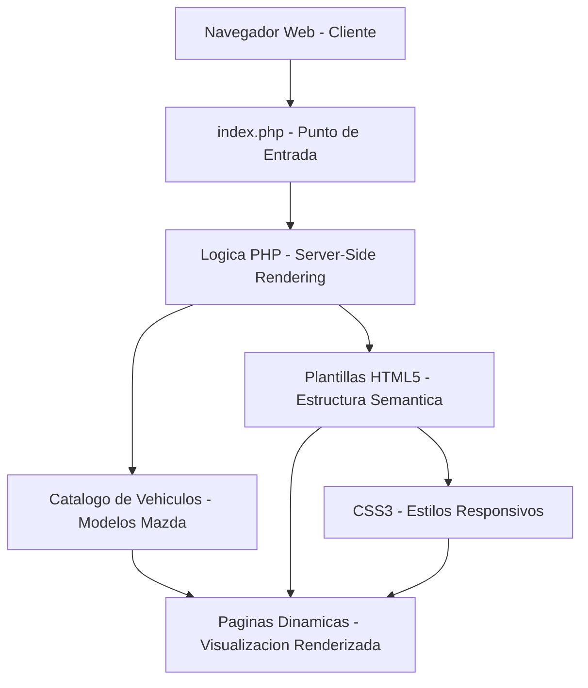

# PHP-Mazda

> Aplicación web para concesionario automotriz Mazda desarrollada en PHP.

## Descripción

---

Prototipo de aplicación web orientada a la gestión y visualización del catálogo de vehículos de un concesionario Mazda. Implementa la lógica de presentación del lado del servidor con PHP, estructuración semántica en HTML5 y estilos responsivos en CSS3.

## Tecnologías

| Tecnología | Uso |
|---|---|
| PHP | Lógica de servidor y renderizado dinámico |
| HTML5 | Estructura semántica del contenido |
| CSS3 | Diseño visual y responsividad |

## Arquitectura

## Autor

**Alejandro De Mendoza** — Ingeniero Informático · Especialista en IA · Máster en Arquitectura de Software

---

## Autor

**Alejandro De Mendoza**  
Ingeniero Informático · Especialista en IA · Especialista en Ingeniería de Software · Máster en Arquitectura de Software

